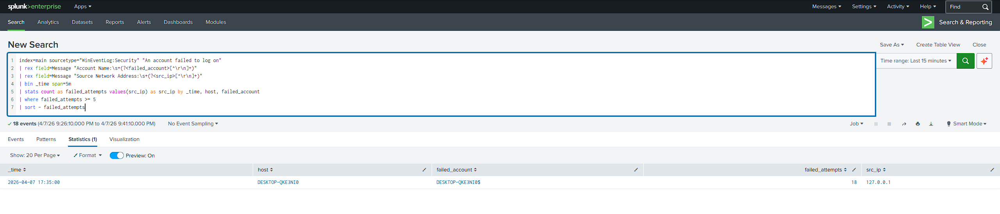
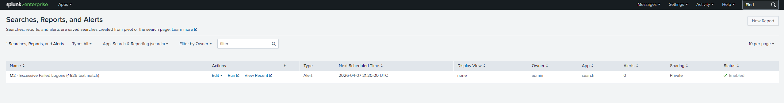
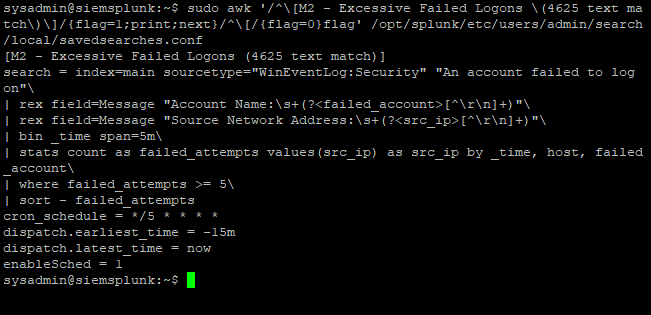
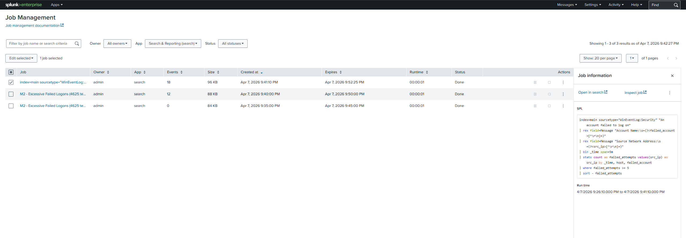

# SIEM Lab - Milestone 2 (Detection Engineering: Repeated Failed Logons)

## Executive summary

In this milestone, I implemented and validated a practical SOC detection for repeated failed Windows logon attempts (4625 behavior) in Splunk.
The detection uses threshold logic over a short time window and is operationalized as a scheduled alert.

This milestone demonstrates:
- endpoint log collection troubleshooting,
- SPL detection engineering,
- threshold tuning,
- and evidence-based validation in a homelab SOC workflow.

---

## Objective

Design one reliable alert that identifies potentially suspicious authentication activity:

- multiple failed logons
- from the same host/account
- within a short rolling window

Target outcome: produce a low-noise, repeatable signal suitable for analyst triage.

---

## Lab environment

| Component | Role |
|-----------|------|
| **Proxmox** (Lenovo m720q) | Hypervisor hosting lab VMs |
| **Ubuntu Server VM** (`siemsplunk`) | Splunk Enterprise (search + index) |
| **Windows 10 VM** (`DESKTOP-QKE3NI0`) | Log source + Splunk Universal Forwarder |
| **Network** | Same LAN segment for forwarding + Splunk UI access |

---

## Milestone 2 implementation details

### 1) Data-source verification and troubleshooting

Initial failed-logon queries returned no results, so ingestion was validated first.

Troubleshooting sequence:
1. Verified `WinEventLog:Security` presence in Splunk.
2. Found Security logs were not forwarded because `inputs.conf` for Security was missing.
3. Added Security log collection stanza on the Windows forwarder.
4. Restarted Splunk Universal Forwarder.
5. Re-validated Security event ingestion successfully.

### 2) Security log input configured

`inputs.conf` on Windows forwarder:

```ini
[WinEventLog://Security]
disabled = 0
start_from = newest
current_only = 0
checkpointInterval = 5
index = main
```

### 3) Detection query design

In this environment, normalized fields (`EventCode` / `EventID`) were not consistently available in search results.
To keep detection reliable, this rule matches canonical failed-logon text and extracts fields from `Message` using `rex`.

---

## Detection logic (SPL)

```spl
index=main sourcetype="WinEventLog:Security" "An account failed to log on"
| rex field=Message "Account Name:\s+(?<failed_account>[^\r\n]+)"
| rex field=Message "Source Network Address:\s+(?<src_ip>[^\r\n]+)"
| bin _time span=5m
| stats count as failed_attempts values(src_ip) as src_ip by _time, host, failed_account
| where failed_attempts >= 5
| sort - failed_attempts
```

### Logic explanation

- **Filter:** Windows Security events containing failed-logon message text.
- **Field extraction:** pull `failed_account` and `src_ip` from raw message body.
- **Time bucketing:** group into 5-minute windows for burst detection.
- **Threshold:** keep hits where `failed_attempts >= 5`.
- **Output:** analyst-friendly fields for triage.

---

## Alert operationalization

Alert created from query:

- **Name:** `M2 - Excessive Failed Logons (4625 text match)`
- **Type:** Scheduled
- **Cron:** `*/5 * * * *` (every 5 minutes)
- **Search time range:** Last 15 minutes
- **Trigger condition:** Number of results > 0
- **Trigger mode:** Once
- **Action:** Add to Triggered Alerts
- **Status:** Enabled

---

## Validation and testing

### Test method

- Generated repeated intentional bad password attempts on the Windows endpoint.
- Re-ran detection query in Splunk.
- Confirmed non-zero result rows with expected grouping and threshold hits.
- Saved and verified alert in Splunk Searches/Reports/Alerts list.

### Validation outcome

Detection surfaced repeated failed logons and provided useful triage context:
- target account (`failed_account`)
- event volume (`failed_attempts`)
- source context (`src_ip`)
- affected host (`host`)

### Post-rebuild verification (2026-04-08)

After rebuilding the Splunk VM, the alert was re-verified end-to-end:
- Alert object present in Splunk Web (`Type: Alert`, `Enabled`, scheduled).
- File-level alert settings confirmed in `savedsearches.conf`:
  - `cron_schedule = */5 * * * *`
  - `dispatch.earliest_time = -15m`
  - `dispatch.latest_time = now`
  - SPL threshold remains `failed_attempts >= 5`
- Fire test executed with intentional failed logons; query results and job history showed successful scheduled execution and threshold hits.

Note: in this lab state, editing all alert fields from Splunk Web was limited because the saved search was managed via config file on disk, so verification used both UI and file evidence.

---

## Analyst interpretation

A high count of failed logons in a short interval can indicate:
- password guessing / brute-force behavior,
- repeated user typos,
- stale service credentials,
- or scripted authentication failures.

This alert is a **triage signal**, not a final incident verdict by itself.

---

## False positives and tuning considerations

Possible benign causes:
- user typo bursts,
- stale credentials in tasks/services,
- local lab loopback activity (`127.0.0.1`),
- account lockout policy behavior.

Tuning options:
- raise threshold (e.g., 8 or 10),
- suppress known benign accounts,
- parse `Logon Type` and scope to high-risk patterns,
- add cooldown/suppression for repeated duplicate alerts.

---

## Suggested triage playbook

When alert fires:

1. Validate the target account and privilege level.
2. Review source context (`src_ip`) and host.
3. Check for nearby successful logons after failures.
4. Correlate with endpoint events for suspicious process activity.
5. Decide response: monitor, reset credentials, or escalate containment.

---

## Evidence









---

## Milestone outcome

Milestone 2 is complete:
- Security log ingestion path validated end-to-end.
- One threshold-based failed-logon detection implemented.
- Detection operationalized as a scheduled alert.
- Results documented with reproducible SPL and evidence screenshots.

---

## Next steps (Milestone 3 candidates)

- Install Sysmon and forward telemetry.
- Add one process-execution detection (e.g., suspicious PowerShell).
- Build a small dashboard for auth anomalies.
- Add a lightweight response runbook.

---

*No secrets, credentials, or private keys are stored in this repository.*
