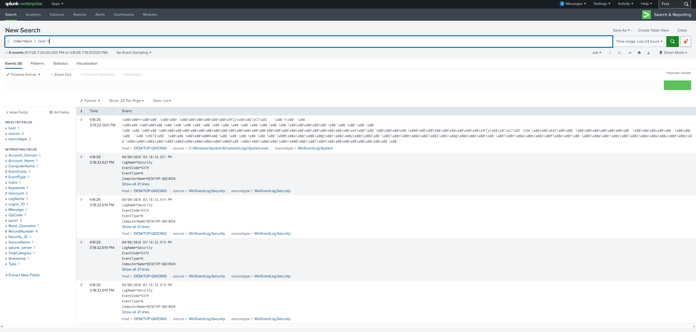
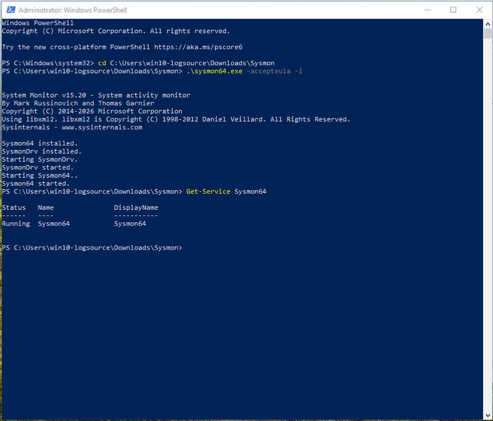
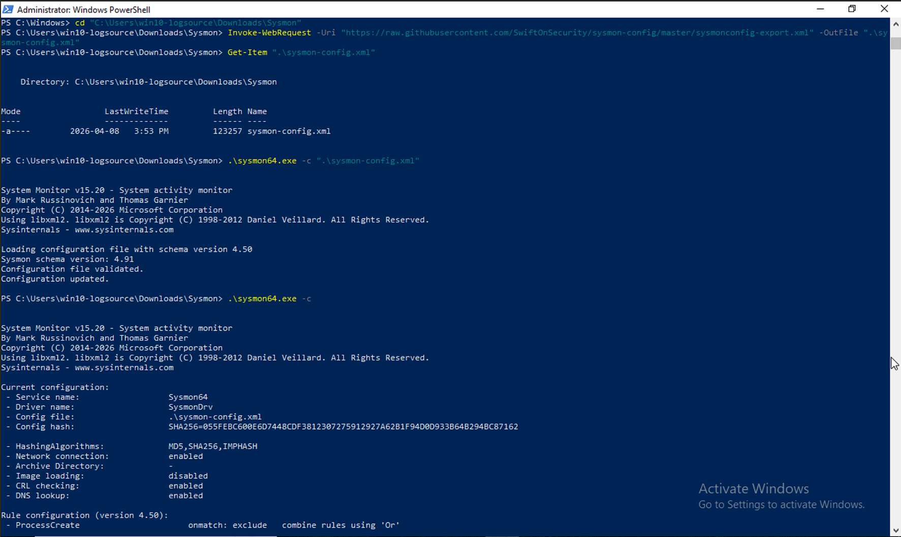
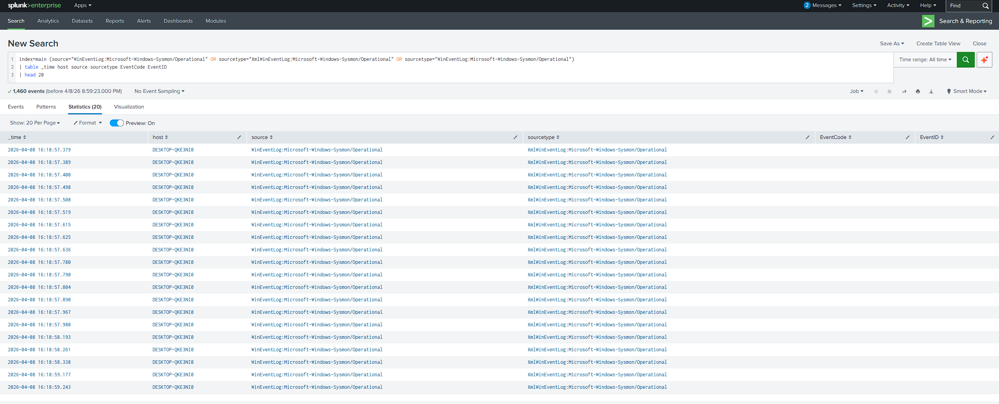
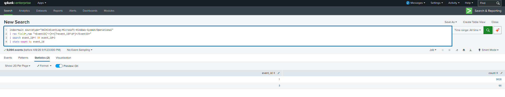
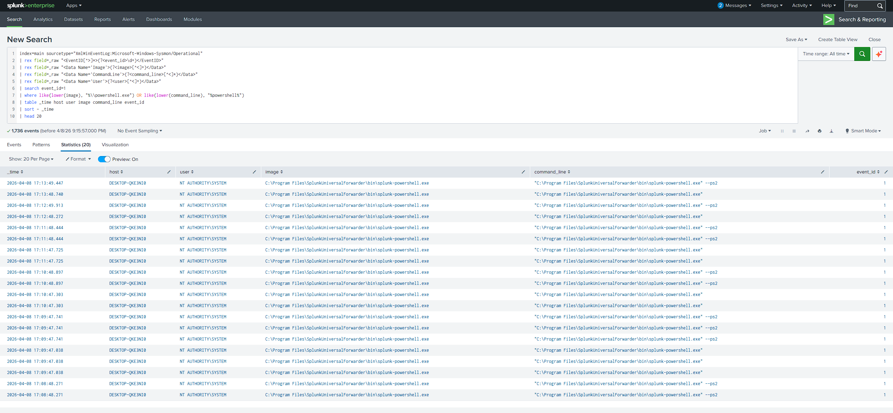
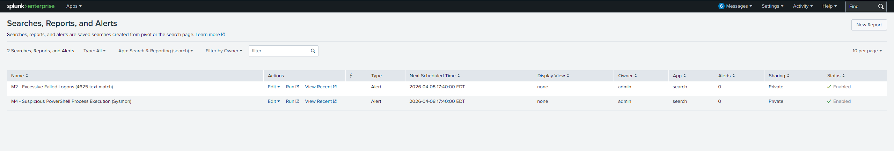
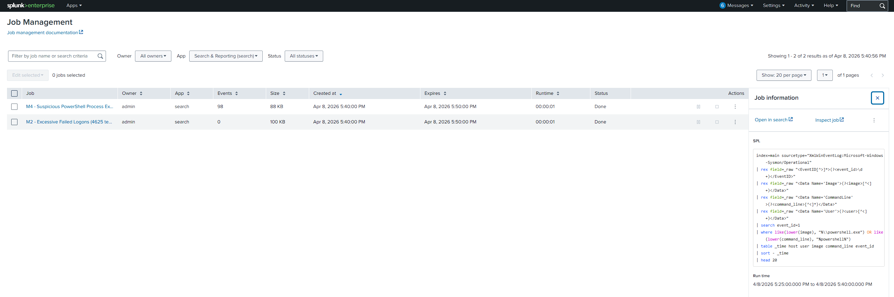

# SIEM Lab - Milestone 4 (Sysmon + Process-Based Detection)

## Executive summary

Milestone 4 extends the SIEM lab from Windows Security-only detection to endpoint telemetry using Sysmon.  
In this phase, Sysmon was installed on the Windows log source, forwarded through Splunk Universal Forwarder (UF), validated in Splunk, and used to build the first process-based detection for suspicious PowerShell execution.

This milestone demonstrates:
- endpoint telemetry onboarding and troubleshooting,
- WinEventLog/Sysmon channel debugging across Windows + UF + Splunk,
- SPL field extraction from XML event payloads,
- and operationalizing a scheduled detection in a Free-tier-constrained lab workflow.

---

## Objective

Add Sysmon telemetry and implement one process-based detection that is:
- reproducible,
- evidence-backed,
- and suitable for SOC triage in a homelab environment.

---

## Environment and scope

| Component | Role |
|---|---|
| Proxmox host | Hypervisor for lab VMs |
| Ubuntu VM `siemsplunk` (`192.168.1.103`) | Splunk indexer/search head |
| Windows 10 VM `DESKTOP-QKE3NI0` | Endpoint + Sysmon + UF |
| Splunk Universal Forwarder | Forwards WinEventLog channels to indexer |

Scope for Milestone 4:
1. confirm Splunk health,
2. install/configure Sysmon,
3. validate Sysmon ingestion,
4. validate key Sysmon event types,
5. create and schedule one process-based detection,
6. validate run evidence and document findings.

---

## Implementation walkthrough

### 1) Splunk gate health check

Baseline ingestion gate passed with:

```spl
index=main | head 5
```

Purpose: ensure search pipeline is healthy before adding a new telemetry source.

### 2) Sysmon installation

Sysmon was installed on the Windows endpoint with administrator privileges:

```powershell
.\sysmon64.exe -accepteula -i
Get-Service Sysmon64
```

Observed: Sysmon service running.

### 3) Sysmon baseline config application

Baseline config file was downloaded and applied:

```powershell
Invoke-WebRequest -Uri "https://raw.githubusercontent.com/SwiftOnSecurity/sysmon-config/master/sysmonconfig-export.xml" -OutFile ".\sysmon-config.xml"
.\sysmon64.exe -c ".\sysmon-config.xml"
.\sysmon64.exe -c
```

Observed: configuration validated and updated.

### 4) UF input configuration for Sysmon channel

Windows UF local config used:

`C:\Program Files\SplunkUniversalForwarder\etc\system\local\inputs.conf`

```ini
[WinEventLog://Microsoft-Windows-Sysmon/Operational]
disabled = 0
index = main
start_from = newest
current_only = 0
checkpointInterval = 5
renderXml = true
suppress_checkpoint = 1
```

UF then restarted to load new input settings.

### 5) Sysmon ingestion troubleshooting path

Initial ingestion checks failed even though:
- Sysmon channel existed locally,
- UF output target was correct (`192.168.1.103:9997`),
- and local Sysmon events were visible via `Get-WinEvent`.

Troubleshooting showed UF errors:
- `WinEventLogChannel::queryEvtChannel: Failed to query Windows Event Log channel=Microsoft-Windows-Sysmon/Operational`
- bookmark/seek-related initialization failures.

Root-cause mitigation that unblocked ingestion:
- verified effective Sysmon stanza via `btool`,
- changed UF service account from `NT SERVICE\SplunkForwarder` to `LocalSystem`,
- restarted service,
- reran strict Sysmon channel query in Splunk.

After this change, Sysmon channel events appeared in `index=main` with:
- `source=WinEventLog:Microsoft-Windows-Sysmon/Operational`
- `sourcetype=XmlWinEventLog:Microsoft-Windows-Sysmon/Operational`

### 6) Key Sysmon event type validation

In this lab, direct `EventID` extraction from raw XML made validation reliable:

```spl
index=main sourcetype="XmlWinEventLog:Microsoft-Windows-Sysmon/Operational"
| rex field=_raw "<EventID[^>]*>(?<event_id>\d+)</EventID>"
| stats count by event_id
| sort - count
```

Focused check:

```spl
index=main sourcetype="XmlWinEventLog:Microsoft-Windows-Sysmon/Operational"
| rex field=_raw "<EventID[^>]*>(?<event_id>\d+)</EventID>"
| search event_id=1 OR event_id=3
| stats count by event_id
```

Observed: both Event ID `1` (process create) and `3` (network connect) present.

### 7) Process-based detection (suspicious PowerShell execution)

Detection SPL:

```spl
index=main sourcetype="XmlWinEventLog:Microsoft-Windows-Sysmon/Operational"
| rex field=_raw "<EventID[^>]*>(?<event_id>\d+)</EventID>"
| rex field=_raw "<Data Name='Image'>(?<image>[^<]+)</Data>"
| rex field=_raw "<Data Name='CommandLine'>(?<command_line>[^<]*)</Data>"
| rex field=_raw "<Data Name='User'>(?<user>[^<]+)</Data>"
| search event_id=1
| where like(lower(image), "%\\powershell.exe") OR like(lower(command_line), "%powershell%")
| table _time host user image command_line event_id
| sort - _time
| head 20
```

Observed: query returned PowerShell process execution events suitable for triage.

### 8) Alert operationalization (Free-tier-compatible workflow)

Because Splunk Free UI constraints limited normal "Save As Alert" workflow, the detection was first saved in UI and then operationalized using config-backed scheduling/alert settings.

Alert object name:

`M4 - Suspicious PowerShell Process Execution (Sysmon)`

Target settings:
- schedule: `*/5 * * * *`
- dispatch window: `-15m` to `now`
- trigger threshold: results `> 0`
- enabled state: true

Final UI verification showed M4 object enabled with next scheduled run time.

### 9) Fire test and run evidence

A safe PowerShell command was executed on the Windows endpoint to generate test activity.
Scheduled run evidence was then validated in Splunk Job Management for the M4 search object, confirming post-deployment execution with result rows.

---

## Analyst interpretation and tuning notes

### Detection intent

This rule surfaces process create events where PowerShell appears in image path or command line.  
It is a practical first endpoint behavior signal, not a high-confidence incident verdict by itself.

### Likely true-positive indicators

- unusual parent/child process lineage,
- suspicious encoded command usage,
- PowerShell from atypical accounts/hosts/time windows,
- repeated bursts combined with lateral movement indicators.

### Likely benign causes

- administrative scripts,
- management/monitoring agents,
- expected automation jobs.

### Initial tuning opportunities

- exclude known benign Splunk UF internal PowerShell usage,
- baseline frequent administrative command lines and suppress known-good patterns,
- enrich with parent process and account allowlists,
- add thresholding over short windows to reduce single-event noise.

---

## Evidence

















---

## Milestone outcome

Milestone 4 objective achieved for scoped implementation:
- Sysmon successfully onboarded and ingested,
- key Sysmon process/network event families validated,
- first process-based detection built and scheduled,
- scheduled run evidence validated with fire-test screenshot,
- full reproducible evidence captured for portfolio reporting.

This milestone establishes a stronger endpoint-centric foundation for the next phase (deeper process analytics and higher-fidelity behavioral detections).

